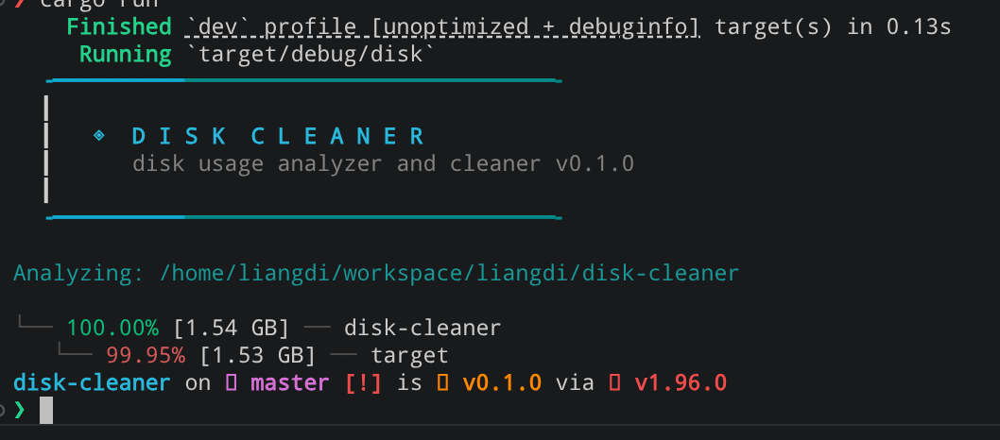
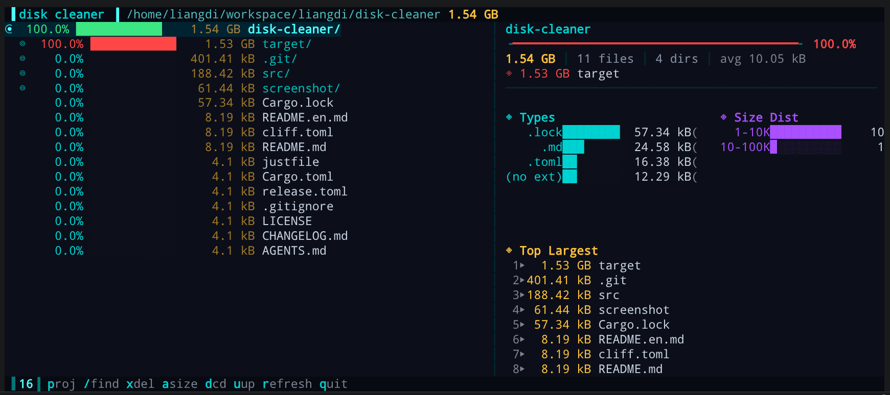
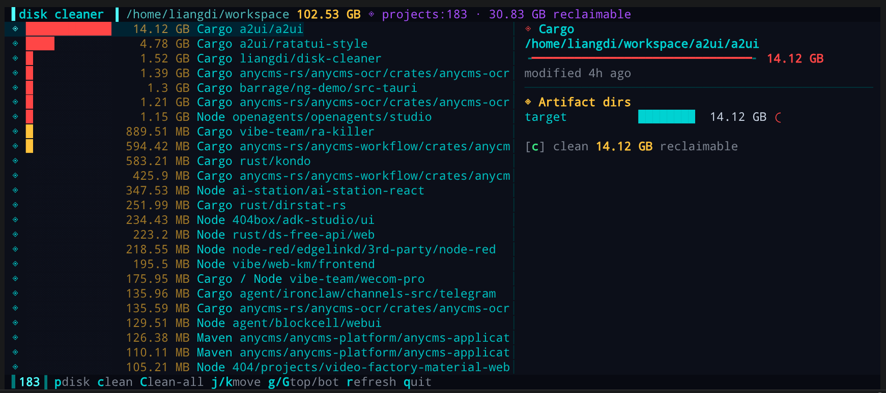

# disk-cleaner

**English** | [中文](README.md)

A fast, cross-platform disk usage analyzer and cleaner for the terminal — a
WinDirStat-style tree browser plus a Kondo-style build-artifact cleaner, in one
`disk` command.


- **Two views in one tool.** Browse a live size-weighted directory tree, or flip
  to *Projects* mode and reclaim space from stale build artifacts.
- **Real on-disk size.** Reports allocated blocks on Unix and NTFS-compressed
  size on Windows — or logical length with `-a`.
- **Parallel scanning.** Walks the tree with `rayon`, so large filesystems stay
  responsive. Scans also respect filesystem boundaries (no crossing mounts).
- **Interactive TUI.** A sci-fi HUD interface with a tree, detail panel, gauges,
  histograms, search, and on-the-fly delete — driven by an editable CSS theme.
- **Clean 23 ecosystems.** Projects mode detects Cargo, Node, Unity, Maven,
  CMake, Unreal, Python, and more, and offers one-keystroke cleanup.

## Installation

### Build from source

```sh
git clone https://github.com/Liangdi/disk-cleaner
cd disk-cleaner
cargo build --release
# binary is at target/release/disk
```

Then put it on your `PATH`, e.g.:

```sh
sudo cp target/release/disk /usr/local/bin/
```

### Install directly from git

```sh
cargo install --git https://github.com/Liangdi/disk-cleaner
```

## Usage

```sh
disk [OPTIONS] [PATH]
```

If `PATH` is omitted, the current directory is analyzed.

### Options

| Flag              | Description                                                         |
|-------------------|---------------------------------------------------------------------|
| `-d <depth>`      | Maximum recursion depth in the tree (default `1`)                   |
| `-m <percent>`    | Minimum share of parent to show an entry, `0`–`100` (default `0.1`) |
| `-a`              | Show apparent (logical) size instead of allocated disk size         |
| `-j`              | Emit sorted JSON instead of the tree                                |
| `-t`, `--tui`     | Launch the interactive TUI                                          |

### Examples

```sh
disk                      # current directory, depth 1
disk -d 3                 # deeper tree
disk -a PATH              # apparent size
disk -m 1 PATH            # only entries ≥ 1% of their parent
disk -j PATH              # JSON output
disk --tui                # interactive TUI on the current directory
disk --tui /path/to/dir   # interactive TUI on a directory
```

### CLI output

Each row prints a color-coded share-of-parent percentage and an allocated size;
directories are suffixed with `/`. Color signals magnitude — green for the root,
red for the heavy hitters, cyan otherwise.

```
$ disk -d 2 ~/projects
  ╺━━━━━━━━━━━━━━━━━━━━━━━━━━━━━━━━━╸
  ┃
  ┃   ◈  D I S K  C L E A N E R
  ┃      disk usage analyzer and cleaner v0.1.0
  ┃
  ╺━━━━━━━━━━━━━━━━━━━━━━━━━━━━━━━━━╸

Analyzing: /home/you/projects

 82.34% [12.4 GB] ─── rust/
 ├ 11.82% [1.8 GB]  ─── node/
 ├  3.05% [480 MB]  ─── python/
 └  0.61% [96 MB]   ─── go/
```



## TUI mode

Launch with `--tui`. The TUI runs all scanning in background threads and shows
an animated loading splash while it works, so the interface never blocks.

### Disk view — size-weighted directory tree

- **Left panel** — navigable directory tree. Expand/collapse any node; sizes
  update live as you descend.
- **Right panel** — detail stats for the selection: breadcrumb path, proportion
  gauge, quick counts, file-type distribution, a file-size histogram, and the
  top largest descendants.



### Projects view — build-artifact cleaner

Switch to Projects with `p` or `Tab`. It scans the subtree under the cursor and
lists every detected build project with its reclaimable size, sorted largest
first. The right panel shows the ecosystem, a reclaimable gauge, a per-artifact
breakdown (e.g. `target`, `node_modules`), and the project's age.

Clean the selected project, or all of them at once — both gated by a
confirmation dialog. The title bar tracks total reclaimable across the list.



### Key bindings

Shared:

| Key        | Action                                   |
|------------|------------------------------------------|
| `p` / `Tab`| Switch between Disk and Projects views   |
| `r`        | Re-scan the current view                 |
| `q` / `Ctrl-C` | Quit                                |

Disk view:

| Key                | Action                              |
|--------------------|-------------------------------------|
| `j` / `↓`          | Move down                           |
| `k` / `↑`          | Move up                             |
| `Enter` / `l` / `→` | Expand directory                   |
| `Backspace` / `h` / `←` | Collapse directory             |
| `Space`            | Toggle expand / collapse            |
| `d`                | Enter the selected directory (rescan) |
| `u`                | Go up to the parent directory (rescan) |
| `/`                | Search / filter                     |
| `a`                | Toggle apparent vs. disk size       |
| `.`                | Toggle hidden entries               |
| `x`                | Delete the selected item            |
| `g`                | Jump to top                         |
| `G`                | Jump to bottom                      |

Projects view:

| Key          | Action                              |
|--------------|-------------------------------------|
| `j` / `↓`    | Move down                           |
| `k` / `↑`    | Move up                             |
| `c` / `Enter`| Clean the selected project          |
| `C`          | Clean **all** listed projects       |
| `g`          | Jump to top                         |
| `G`          | Jump to bottom                      |

Confirmation dialogs accept `y`/`Y` to confirm or `n`/`N`/`Esc` to cancel.

## Supported project ecosystems

Projects mode detects these build systems and their artifact directories:

| Ecosystem                | Ecosystem            | Ecosystem        |
|--------------------------|----------------------|------------------|
| Cargo (Rust)             | Node (incl. React Native) | Unreal       |
| Unity                    | Stack / Cabal (Haskell) | Gradle        |
| SBT / Maven (JVM)        | CMake                | Jupyter         |
| Python                   | Pixi                 | Composer (PHP)  |
| Pub (Dart/Flutter)       | Elixir               | Swift           |
| Zig                      | Godot 4.x            | .NET            |
| Turborepo                | Terraform            | CocoaPods       |

A directory matching more than one ecosystem is reported with all of them — e.g.
a `Cargo.toml` + `package.json` project is `Cargo / Node`, and cleaning reclaims
the union of `target` and `node_modules`. The scanner descends into projects
while pruning artifact directories, so nested projects (e.g. Cargo workspace
sub-crates) are found without descending into build output.

## Theming

The interactive UI is styled from [src/tui/theme.css](src/tui/theme.css), loaded
at compile time via `ratatui-style`. Edit the CSS variables and selectors there
to re-theme the app — no Rust changes required. (The loading splash is a
procedural animation and is not CSS-driven.)

## License

MIT
